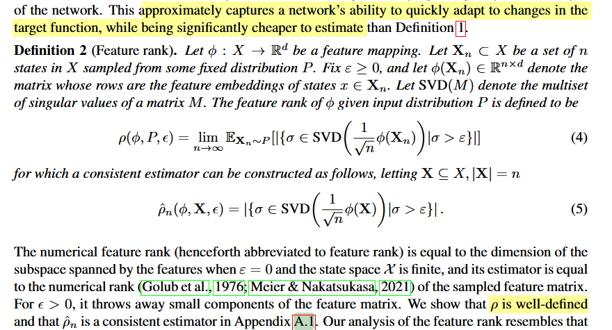
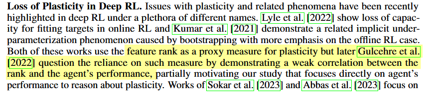
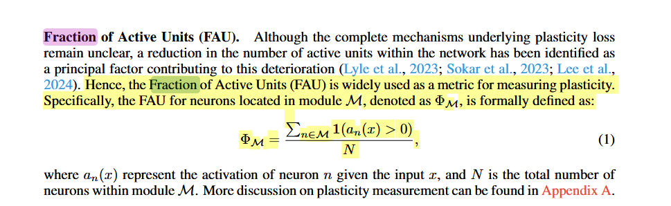
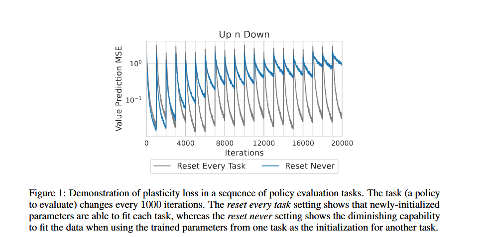

1. **Weight Norm**  
   - **What it Measures**: The size (or norm) of weights in the neural network, often calculated for both the encoder and the head layers.
   - **Role in Plasticity**: Serves both as an indicator of when to maintain plasticity and as a way to control plasticity through techniques like L2 regularization.
   - **Limitations**: Sensitive to different environments and ineffective at directly controlling plasticity.
   - **References**: Sokar et al., 2023; Nikishin et al., 2024.

2. **Feature Rank**  
   - **What it Measures**: The rank of feature matrices, which provides an approximation of the network’s adaptability.
   - **Role in Plasticity**: A proxy for plasticity loss; low feature rank often correlates with reduced network performance.
   - **Limitations**: Correlation between feature rank and plasticity loss appears primarily in restricted settings.
   - **References**: Kumar et al., 2020; Lyle et al., 2021; Gulcehre et al., 2022.

https://arxiv.org/pdf/2204.09560

If the feature rank ρρ diminishes significantly over time, it suggests that the network has lost flexibility and is no longer able to represent new features or adapt effectively—essentially indicating a reduction in the network’s plasticity.

https://arxiv.org/pdf/2305.15555

3. **Loss Landscape**  
   - **What it Measures**: The shape of the loss landscape, particularly gradients in backpropagation, which can indicate how easy it is to optimize the network.
   - **Role in Plasticity**: Reflects adaptability by showing how steep or flat the loss function is around the current model state.
   - **Limitations**: Requires computing the Hessian matrix or gradient covariance, which can be computationally expensive.
   - **References**: Lyle et al., 2023.

The loss landscape provides a direct and detailed view into plasticity. When evaluating plasticity loss, we look for a shift from a flat to a rugged landscape, indicating that the model has become less adaptable. By examining gradient norms, Hessian eigenvalues, and gradient covariance, we get quantitative indicators of plasticity loss. These metrics allow us to observe how “trapped” the network becomes in specific configurations as it learns, highlighting the loss of flexibility that comes with decreased plasticity.

4. **Fraction of Active Units (FAU)**  
   - **What it Measures**: The percentage of units (neurons) that are "active" (i.e., producing non-zero outputs).
   - **Role in Plasticity**: Indicates plasticity by showing how many units are engaged in learning; higher FAU suggests better plasticity maintenance.
   - **Limitations**: Less effective in convolutional networks.
   - **References**: Sokar et al., 2023; Abbas et al., 2023; Lyle et al., 2023 (for limitations).

file:///C:/Users/t_gei/Documents/Master/3.%20Semester/DAP/Zusammenhang%20zwischen%20Plasticity%20Loss%20und%20Data%20Augmentation.pdf

### Summary Table:
| Metric                         | Primary Use                     | Key Limitations                             | References                                                   |
| ------------------------------ | ------------------------------- | ------------------------------------------- | ------------------------------------------------------------ |
| Weight Norm                    | Indicator/control               | Sensitive to environments                   | Sokar et al., 2023; Nikishin et al., 2024                    |
| Feature Rank                   | Proxy for plasticity loss       | Restricted correlation with plasticity loss | Kumar et al., 2020; Lyle et al., 2021; Gulcehre et al., 2022 |
| Loss Landscape                 | Reflects adaptability           | High computational cost                     | Lyle et al., 2023                                            |
| Fraction of Active Units (FAU) | Practical plasticity assessment | Limitations in convolutional networks       | Sokar et al., 2023; Abbas et al., 2023; Lyle et al., 2023    |

Weight norm vs. Loss landscape:
They are not the same, but can be complementary: weight norm provides a quick estimate of plasticity, whereas loss landscape analysis offers a deeper, more precise assessment.

https://arxiv.org/pdf/2305.15555